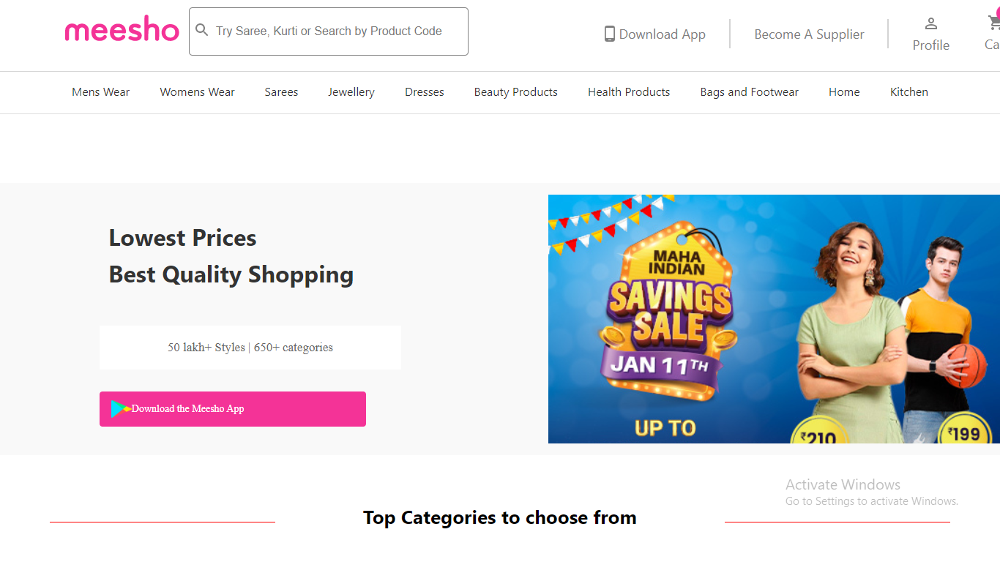
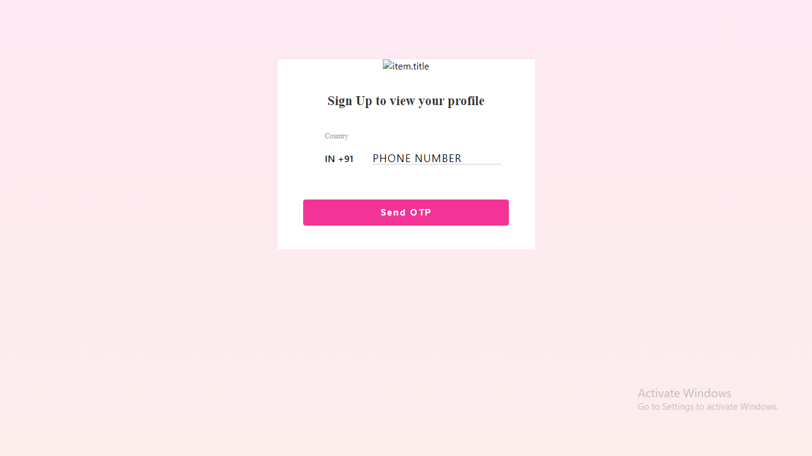
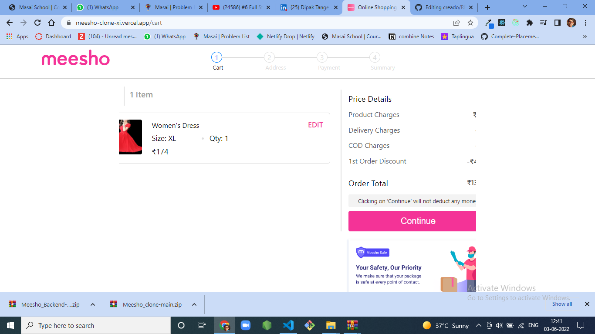
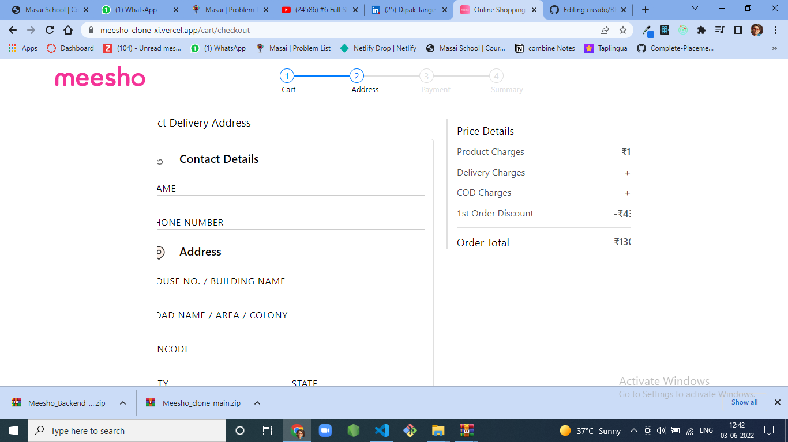

# Meesho-
An e-commerce Indian website of wide range of apparel, cosmetics, household items, and many more categories


## Deployed link of project
- https://meesho-clone-xi.vercel.app/


## Team Members

<ul>
  
 
</ul>


## Deployment

To run this project. In backend terminal perform:

```bash
  npm start
```

On frontend terminal perform:

```bash
  Open index.html with live server
```


## 🛠 Tech Stack

- React
- Redux
- Material UI
- Javascript
- MongoDB
- Express.js
- Node.js
- Mongoose
- NPM - Dotenv, jsonwebtoken , bcryptjs 
- Local storage

## Functionality

- Authentication
- Seller page to add product
- Add to cart
- Payment Page with Discount Functionality
- Search option to Search for product
- Checkout
- Indivisual Product description

## Website flow for User

- Home page

- Category wise products

- search on navbar

- Product page(List of all products)

- Single product page

- Cart page

- Address page

- Payment page , One Time Password verification page.

## Snapshots 📷

1. Landing Page

   

2. Register Page

   

3. Product Page

   

4. Cart Page

   

5. Checkout Page

   

<br>


## Thank you note
Thank you all who is giving precious time to visit my little creative project which is made with lot of efforts.